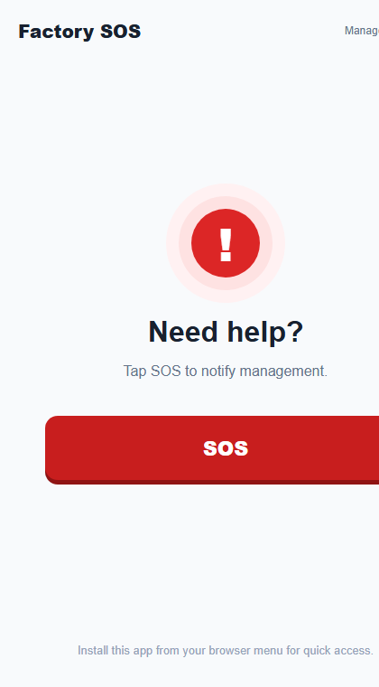

# Factory SOS PWA 🏭🏭

A simple, free factory assistance system for worker tablets.

Workers press an SOS button when they need help. The local server records the request and sends an email alert to management.

## Features

- Installable on Android tablets from Chrome
- Simple SOS form: issue type, worker, location, and note
- Email alert sent to up to five manager addresses
- Manager settings page for changing recipient email addresses
- Local SOS history
- No Firebase, subscriptions, or license cost

## Screenshot

Worker SOS screen, designed for quick use on a tablet:



## How it works

```text
Worker tablet -> Factory SOS server -> SMTP email -> Managers
```

The server should run on a PC connected to the factory Wi-Fi. Tablets open the app using that PC's local IP address.

## Quick start

1. Install [Node.js LTS](https://nodejs.org/) on the PC that will host the app.
2. Download or clone this repository.
3. Open a terminal in the project folder.
4. Install the required package:

   ```powershell
   npm install
   ```

5. Copy `.env.example` to `.env` and set a strong manager password:

   ```env
   ADMIN_PASSWORD=change-this-password
   PORT=3000
   ```

6. Start the server:

   ```powershell
   npm start
   ```

7. Open `http://localhost:3000` on the host PC.

## Set up email alerts

1. Open **Manager settings** in the app.
2. Sign in with `ADMIN_PASSWORD` from `.env`.
3. Enter at least one manager email address (up to five).
4. Enter the SMTP details for the sending email account.
5. Save the settings and send a test SOS.

For a personal Gmail test account:

```text
SMTP server: smtp.gmail.com
SMTP port: 587
Secure connection: off
SMTP username: your-address@gmail.com
SMTP password: Google App Password (not your normal Gmail password)
```

## Install on Android tablets

1. Find the host PC's IPv4 address by running `ipconfig`.
2. On a tablet connected to the same Wi-Fi, open `http://HOST-PC-IP:3000` in Chrome.
3. In Chrome, choose **Install app** or **Add to Home screen**.

Example: `http://192.168.1.50:3000`

## Important notes

- Keep the host PC running while the system is in use.
- Allow Node.js through Windows Firewall on private networks.
- Keep `.env` and the `data` folder private. They are excluded from Git by `.gitignore`.
- A PWA cannot show a floating SOS bubble above another Android app. That feature requires a native Android app with overlay permission.

## Project structure

```text
public/       Worker PWA screens and service worker
server.js     Node.js server, SOS API, email alerts, and manager settings API
data/         Local settings and SOS history (created automatically; not committed)
```

## License

Add a license file before publishing this repository publicly.
